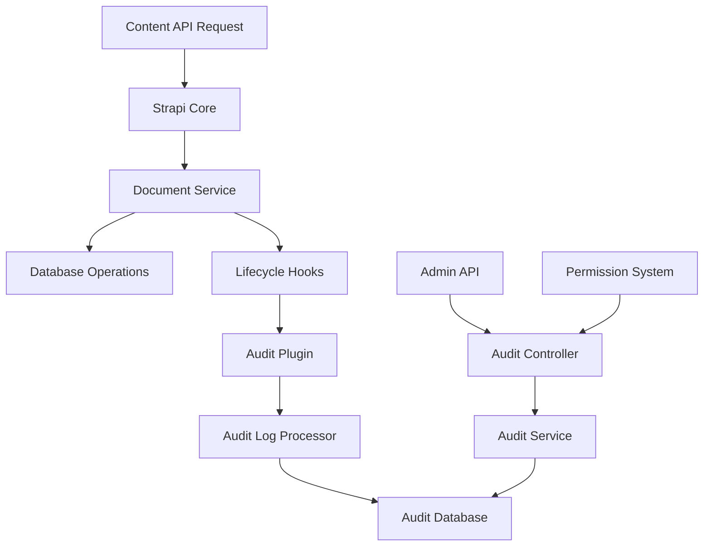

# Design Document: Automated Audit Logging System

## Overview

The Automated Audit Logging system will be implemented as a Strapi plugin that integrates deeply with Strapi's lifecycle hooks and document service to capture all content operations. The system follows a non-intrusive approach, ensuring that audit logging failures do not impact normal content operations while providing comprehensive audit trails for compliance and monitoring purposes.

## Architecture

### High-Level Architecture



### Plugin Architecture

The audit logging system will be implemented as a Strapi plugin with the following structure:

```
packages/plugins/audit-log/
├── server/
│   ├── src/
│   │   ├── bootstrap.ts          # Plugin initialization
│   │   ├── register.ts           # Plugin registration
│   │   ├── index.ts              # Main plugin export
│   │   ├── content-types/        # Audit log content type
│   │   ├── controllers/          # API controllers
│   │   ├── services/             # Business logic services
│   │   ├── routes/               # API routes
│   │   ├── policies/             # Access control policies
│   │   └── config/               # Plugin configuration
│   └── package.json
├── admin/                        # Admin panel integration (future)
└── README.md
```

## Components and Interfaces

### 1. Audit Log Content Type

**Schema Definition:**
```typescript
interface AuditLogEntry {
  id: number;
  contentType: string;        // e.g., 'api::article.article'
  recordId: string;           // ID of the affected record
  action: 'create' | 'update' | 'delete';
  timestamp: Date;
  userId?: number;            // Authenticated user ID
  userEmail?: string;         // User email for reference
  payload: object;            // Full payload for create/delete, diff for update
  metadata: {
    ip?: string;              // Request IP address
    userAgent?: string;       // User agent string
    requestId?: string;       // Request correlation ID
  };
  createdAt: Date;
  updatedAt: Date;
}
```

**Database Indexes:**
- Primary index on `id`
- Composite index on `(contentType, timestamp)`
- Index on `userId`
- Index on `action`
- Index on `timestamp` for date range queries

### 2. Audit Service

**Interface:**
```typescript
interface AuditService {
  createAuditEntry(params: CreateAuditEntryParams): Promise<void>;
  findAuditLogs(filters: AuditLogFilters): Promise<PaginatedAuditLogs>;
  isAuditingEnabled(): boolean;
  isContentTypeExcluded(contentType: string): boolean;
}

interface CreateAuditEntryParams {
  contentType: string;
  recordId: string;
  action: 'create' | 'update' | 'delete';
  userId?: number;
  payload: object;
  metadata?: AuditMetadata;
}

interface AuditLogFilters {
  contentType?: string;
  userId?: number;
  action?: string;
  startDate?: Date;
  endDate?: Date;
  page?: number;
  pageSize?: number;
  sort?: 'asc' | 'desc';
}
```

### 3. Lifecycle Hook Integration

The system will integrate with Strapi's document service lifecycle hooks:

```typescript
// In bootstrap.ts
strapi.documents.use(async (context, next) => {
  const auditService = strapi.plugin('audit-log').service('audit');
  
  if (!auditService.isAuditingEnabled()) {
    return next();
  }
  
  if (auditService.isContentTypeExcluded(context.contentType.uid)) {
    return next();
  }
  
  const beforeData = context.action === 'update' || context.action === 'delete' 
    ? await captureBeforeState(context) 
    : null;
  
  const result = await next();
  
  // Async audit logging (non-blocking)
  setImmediate(() => {
    auditService.createAuditEntry({
      contentType: context.contentType.uid,
      recordId: extractRecordId(context, result),
      action: mapActionType(context.action),
      userId: context.state?.user?.id,
      payload: buildPayload(context.action, context.params, beforeData, result),
      metadata: extractMetadata(context)
    }).catch(error => {
      strapi.log.error('Audit logging failed:', error);
    });
  });
  
  return result;
});
```

### 4. REST API Controller

**Endpoint:** `GET /audit-logs`

**Controller Implementation:**
```typescript
export default {
  async find(ctx) {
    const { query } = ctx.request;
    
    // Validate permissions
    await strapi.plugin('audit-log').service('permission').validateReadAccess(ctx.state.user);
    
    // Parse and validate filters
    const filters = strapi.plugin('audit-log').service('audit').parseFilters(query);
    
    // Fetch audit logs
    const result = await strapi.plugin('audit-log').service('audit').findAuditLogs(filters);
    
    ctx.body = {
      data: result.data,
      meta: {
        pagination: result.pagination
      }
    };
  }
};
```

### 5. Configuration System

**Configuration Schema:**
```typescript
interface AuditLogConfig {
  enabled: boolean;
  excludeContentTypes: string[];
  retentionDays?: number;
  batchSize?: number;
  asyncProcessing?: boolean;
}
```

**Default Configuration:**
```javascript
// config/plugins.js
module.exports = {
  'audit-log': {
    enabled: true,
    config: {
      enabled: true,
      excludeContentTypes: [],
      retentionDays: 365,
      batchSize: 100,
      asyncProcessing: true
    }
  }
};
```

## Data Models

### Audit Log Entry Schema

```javascript
// content-types/audit-log/schema.json
{
  "kind": "collectionType",
  "collectionName": "audit_logs",
  "info": {
    "singularName": "audit-log",
    "pluralName": "audit-logs",
    "displayName": "Audit Log"
  },
  "options": {
    "draftAndPublish": false,
    "timestamps": true
  },
  "attributes": {
    "contentType": {
      "type": "string",
      "required": true,
      "maxLength": 255
    },
    "recordId": {
      "type": "string",
      "required": true,
      "maxLength": 255
    },
    "action": {
      "type": "enumeration",
      "enum": ["create", "update", "delete"],
      "required": true
    },
    "timestamp": {
      "type": "datetime",
      "required": true
    },
    "userId": {
      "type": "integer"
    },
    "userEmail": {
      "type": "string",
      "maxLength": 255
    },
    "payload": {
      "type": "json",
      "required": true
    },
    "metadata": {
      "type": "json"
    }
  }
}
```

### Payload Structure by Action Type

**Create Action:**
```json
{
  "type": "create",
  "data": {
    "title": "New Article",
    "content": "Article content...",
    "publishedAt": "2024-01-15T10:00:00Z"
  }
}
```

**Update Action:**
```json
{
  "type": "update",
  "changes": {
    "title": {
      "from": "Old Title",
      "to": "New Title"
    },
    "content": {
      "from": "Old content...",
      "to": "New content..."
    }
  },
  "updatedFields": ["title", "content"]
}
```

**Delete Action:**
```json
{
  "type": "delete",
  "deletedData": {
    "id": 123,
    "title": "Deleted Article",
    "content": "Article content...",
    "publishedAt": "2024-01-15T10:00:00Z"
  }
}
```

## Error Handling

### Error Handling Strategy

1. **Non-Blocking Approach**: Audit logging failures must never block content operations
2. **Graceful Degradation**: System continues functioning even if audit database is unavailable
3. **Retry Logic**: Implement exponential backoff for transient failures
4. **Circuit Breaker**: Temporarily disable audit logging if persistent failures occur

### Error Handling Implementation

```typescript
class AuditService {
  private circuitBreaker = new CircuitBreaker({
    failureThreshold: 5,
    resetTimeout: 60000
  });
  
  async createAuditEntry(params: CreateAuditEntryParams): Promise<void> {
    if (!this.circuitBreaker.isEnabled()) {
      strapi.log.warn('Audit logging temporarily disabled due to circuit breaker');
      return;
    }
    
    try {
      await this.retryWithBackoff(async () => {
        await strapi.db.query('plugin::audit-log.audit-log').create({
          data: this.buildAuditEntry(params)
        });
      });
      
      this.circuitBreaker.recordSuccess();
    } catch (error) {
      this.circuitBreaker.recordFailure();
      strapi.log.error('Failed to create audit entry:', error);
      
      // Optionally queue for later processing
      if (this.config.fallbackQueue) {
        await this.queueAuditEntry(params);
      }
    }
  }
  
  private async retryWithBackoff(operation: () => Promise<void>, maxRetries = 3): Promise<void> {
    for (let attempt = 1; attempt <= maxRetries; attempt++) {
      try {
        await operation();
        return;
      } catch (error) {
        if (attempt === maxRetries) throw error;
        
        const delay = Math.pow(2, attempt) * 1000; // Exponential backoff
        await new Promise(resolve => setTimeout(resolve, delay));
      }
    }
  }
}
```

## Testing Strategy

### Unit Tests

1. **Service Layer Tests**
   - Audit entry creation with various payload types
   - Filter parsing and validation
   - Configuration loading and validation
   - Error handling scenarios

2. **Controller Tests**
   - API endpoint functionality
   - Permission validation
   - Query parameter handling
   - Response formatting

3. **Integration Tests**
   - Lifecycle hook integration
   - Database operations
   - Permission system integration
   - Configuration system integration

### Test Structure

```typescript
// tests/audit-service.test.ts
describe('Audit Service', () => {
  describe('createAuditEntry', () => {
    it('should create audit entry for create action', async () => {
      // Test implementation
    });
    
    it('should handle database failures gracefully', async () => {
      // Test error handling
    });
    
    it('should respect configuration exclusions', async () => {
      // Test configuration filtering
    });
  });
  
  describe('findAuditLogs', () => {
    it('should filter by content type', async () => {
      // Test filtering
    });
    
    it('should paginate results correctly', async () => {
      // Test pagination
    });
  });
});
```

### Performance Tests

1. **Load Testing**: Verify audit logging doesn't impact content API performance
2. **Stress Testing**: Test system behavior under high audit log volume
3. **Database Performance**: Verify query performance with large audit log datasets

## Security Considerations

### Access Control

1. **Permission-Based Access**: Only users with `read_audit_logs` permission can access audit data
2. **Role Integration**: Integrate with Strapi's existing role-based permission system
3. **API Security**: Validate all input parameters and implement rate limiting

### Data Protection

1. **Sensitive Data Handling**: Avoid logging sensitive fields (passwords, tokens)
2. **Data Retention**: Implement configurable retention policies
3. **Audit Trail Integrity**: Ensure audit logs cannot be modified after creation

### Implementation

```typescript
// services/permission.ts
export default ({ strapi }) => ({
  async validateReadAccess(user: any): Promise<void> {
    const hasPermission = await strapi
      .plugin('users-permissions')
      .service('permission')
      .checkPermission(user, 'plugin::audit-log.audit-log.find');
    
    if (!hasPermission) {
      throw new ForbiddenError('Insufficient permissions to access audit logs');
    }
  },
  
  async registerPermissions(): Promise<void> {
    const actions = [
      {
        section: 'plugins',
        displayName: 'Read audit logs',
        uid: 'read',
        pluginName: 'audit-log',
      }
    ];
    
    await strapi.admin.services.permission.actionProvider.registerMany(actions);
  }
});
```

## Performance Optimization

### Async Processing

1. **Non-Blocking Operations**: Use `setImmediate()` for audit log creation
2. **Batch Processing**: Group multiple audit entries for bulk insertion
3. **Queue System**: Implement fallback queue for high-load scenarios

### Database Optimization

1. **Strategic Indexing**: Create indexes on frequently queried fields
2. **Partitioning**: Consider table partitioning for large datasets
3. **Archival Strategy**: Implement automated archival of old audit logs

### Caching Strategy

1. **Configuration Caching**: Cache plugin configuration to avoid repeated reads
2. **Permission Caching**: Cache permission checks for authenticated users
3. **Query Result Caching**: Cache frequently accessed audit log queries

## Deployment Considerations

### Installation Process

1. **Plugin Installation**: Standard Strapi plugin installation via npm/yarn
2. **Database Migration**: Automatic creation of audit_logs table
3. **Permission Setup**: Automatic registration of audit log permissions

### Configuration Management

1. **Environment Variables**: Support configuration via environment variables
2. **Configuration Validation**: Validate configuration on startup
3. **Hot Reloading**: Support configuration changes without restart

### Monitoring and Observability

1. **Metrics Collection**: Track audit log creation rates and failures
2. **Health Checks**: Provide health check endpoints for monitoring
3. **Logging**: Comprehensive logging for troubleshooting

This design provides a robust, scalable, and maintainable audit logging system that integrates seamlessly with Strapi's architecture while ensuring high performance and reliability.